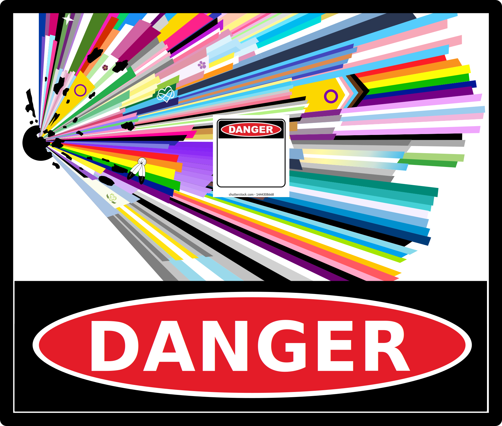
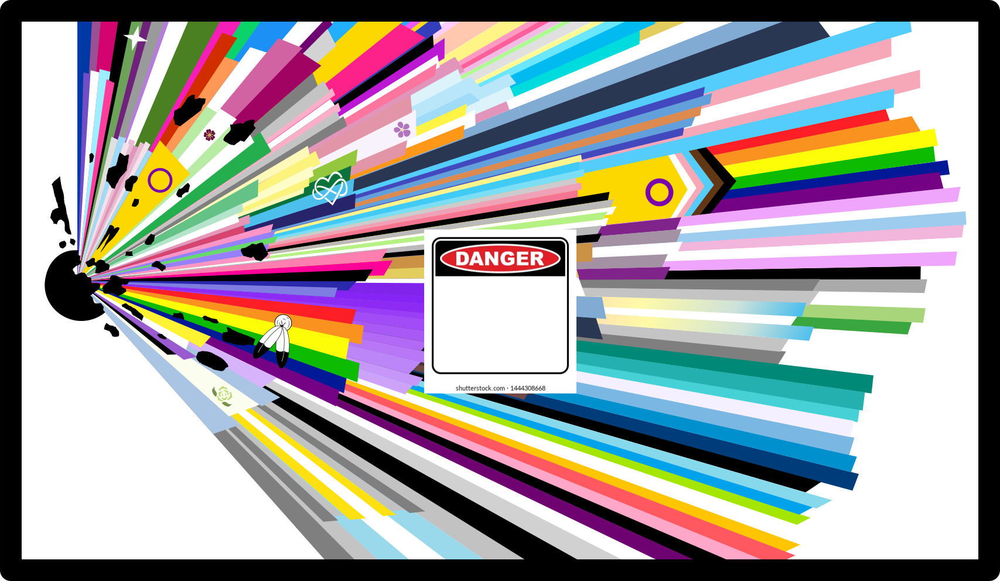
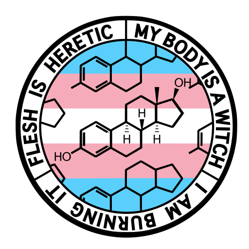
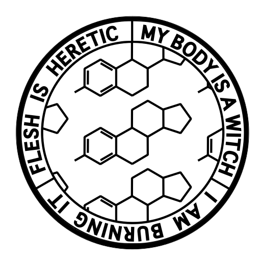

## Gay Explosion

This was created using an edit of the [Microsoft Open Source Pride Flag](https://github.com/microsoft/Pride-flag/)

### Danger Version

### No Text Version

## My Body Is A Witch

The source of this one is complicated but basically the line was taken from the poem Anorexic by Eavan Boland. I first heard this stanza from the song The Heretic by The Sound of Animals Fighting, which was referencing that poem, but I heard it completely devoid of context and it became a mantra of transformation for me instead of a meditation on disordered eating, something I've also struggled with. Anyway.

### Trans Flag

### Black and White

